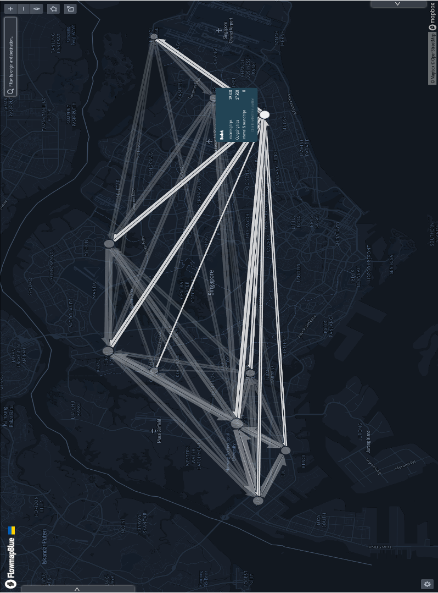

# Visualizations of human travel pattern in Singapore during COVID-19

## Overview
This project focuses on analyzing **human travel patterns** using using Python and R, based on Facebook data, obtained through Facebook Data for Good program. The analysis incorporates **Chord Diagrams** and **Network Flow Analysis** for visualizing and understanding movement data. The idea was to perform a combined analysis between the public policy changes in Singapore and human travel patterns specifically diring COVID-19 period. The project is conducted under the guidance of **Dr. Luo Wei** at **GeoSpatialX Lab**, **National University of Singapore**.

## Visualizations

### Chord Diagram

- The **Chord Diagrams** were created using the **R programming language**.
- These diagrams visualize human movement patterns between cities, with thresholds applied to simplify and declutter the data.

#### Visualization 1: Movement Between 41 Cities
- This diagram shows movement between 41 cities with flows exceeding 500 people.

  

#### Visualization 2: Movement Between 10 Cities
- To enhance clarity, this diagram represents movement between 10 cities with at least 1,000 people.

  

#### Visualization 3: Movement Between 5 Cities
- A refined and beautified diagram showing movement between 5 cities with a threshold of 1,000 people.

  

### Flow Map

- An **interactive Flow Map** was created using [Flowmap.blue](https://flowmap.blue).
- This map represents movement between 10 cities with a minimum of 1,000 people.
- A snapshot of the interactive Flow Map:

  

---

## Future Directions

1. Explore additional datasets to expand the analysis to more regions or time periods.
2. Investigate advanced methods for interactive and dynamic data visualization.
3. Optimize visualizations for use in policy analysis or decision-making.

